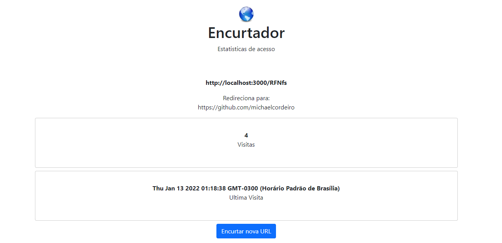
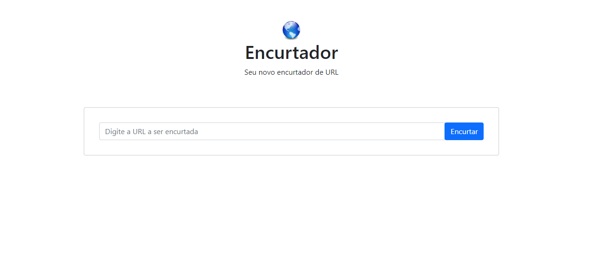

# url-shortener
 Encurtador de URL usando NodeJs, Bootstrap e Sequelize

## Demonstration
 
 

## Techs 
* [ ] NodeJs - Express
* [ ] Bootstrap
* [ ] Ejs
* [ ] Css
* [ ] Sequelize

## instructions
$ npm init
$ npm install express --save

## initialize
npm start

## Author

*Michael Cordeiro*
